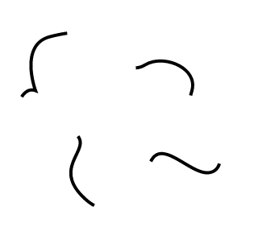
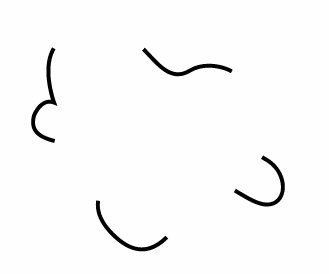
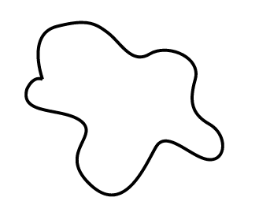

<h1>SVG和animation配合使用（入门）</h1>

这个当然是废话少说，直接上步骤：

<h3>1，首先你要有个svg的图形</h3>

 

<h3>2，这个svg的形状必须有个 stroke </h3>

 

<h3>3,这个线要能够设置成虚线</h3>

	  我们可以用Illustrator把它变成虚线，同样我们也能用css来实现。

	  在HTML中我们这样写：

	  <svg ...>

	  	<path class="path" stroke="#000" ...>

	  </svg>

	  css中这样写：

	  .path{stroke-dasharray:20}

	  这样 我们就得到了长度为20px的虚线。

 

 <h3>4,这些虚线的长度可以更长</h3>

 	css：

 	.path{stroke-dasharray:100;}

 

 <h3>5,我们同样可以给它加上offset属性，真能够让这些虚线移动位置</h3>

   那我们用什么来移动他们的位置呢 正如我们用了animation这个属性

  

	  .path {

		  stroke-dasharray: 100;

		  animation: dash 5s linear;
		}

		@keyframes dash {

		  to {

		    stroke-dashoffset: 1000;

		  }

		}

 <h3>6,想象一下一条虚线的长度覆盖了整个svg图形</h3>

   可以看到，如果虚线变换没有结束之前这就是一个完整的图形。你只是需要把 stroke-dasharray这个属性设置成比你的svg图形的长度还要长

 <h3>7，现在用offset来替换覆盖整个svg图形，但事实上并不是覆盖整个图形</h3>

   这就像这个svg图形并不在那里一样

 <h3>8，现在用css3的animation属性将stroke的offset设置回0</h3>

 

 如果用css来实现这些 ，你需要使用animation中的forwards，这样可以保持最后的状态。

		.path {
		  stroke-dasharray: 1000;
		  stroke-dashoffset: 1000;
		  animation: dash 5s linear forwards;
		}

		@keyframes dash {
		  to {
		    stroke-dashoffset: 0;
		  }
		}

 

