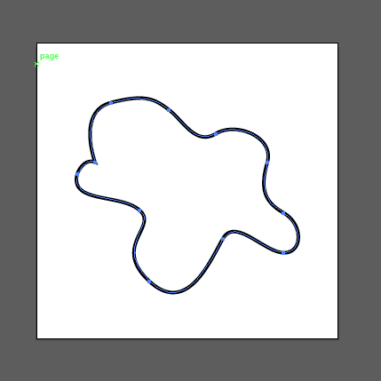
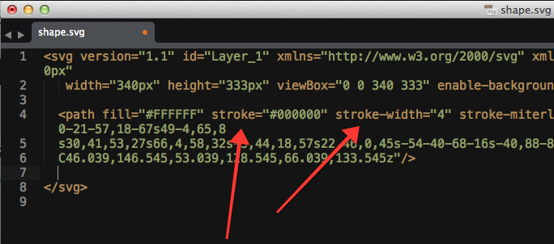
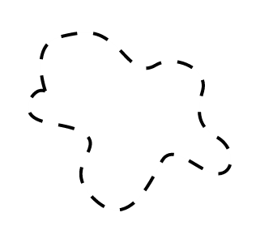

<h1>SVG和animation配合使用（入门）</h1>

这个当然是废话少说，直接上步骤：

<h3>1，首先你要有个svg的图形</h3>

 

<h3>2，这个svg的形状必须有个 stroke </h3>

 

<h3>3,这个线要能够设置成虚线</h3>

	  我们可以用Illustrator把它变成虚线，同样我们也能用css来实现。

	  在HTML中我们这样写：

	  <svg ...>

	  	<path class="path" stroke="#000" ...>

	  </svg>

	  css中这样写：

	  .path{stroke-dasharray:20}

	  这样 我们就得到了长度为20px的虚线。

 

