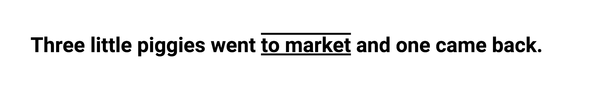

<h1>text-decoration的更多属性</h1>

许多默认的浏览器都是可以通过 text-decoration:underline; 来进行修饰文本。

同样，去掉是 text-decoration:none; 

但是你或许没有察觉到这个属性还有更多的玩法。

<h3>1,文本多个‘下’划线</h3>

	a{text-decoration:underline overline}

 

