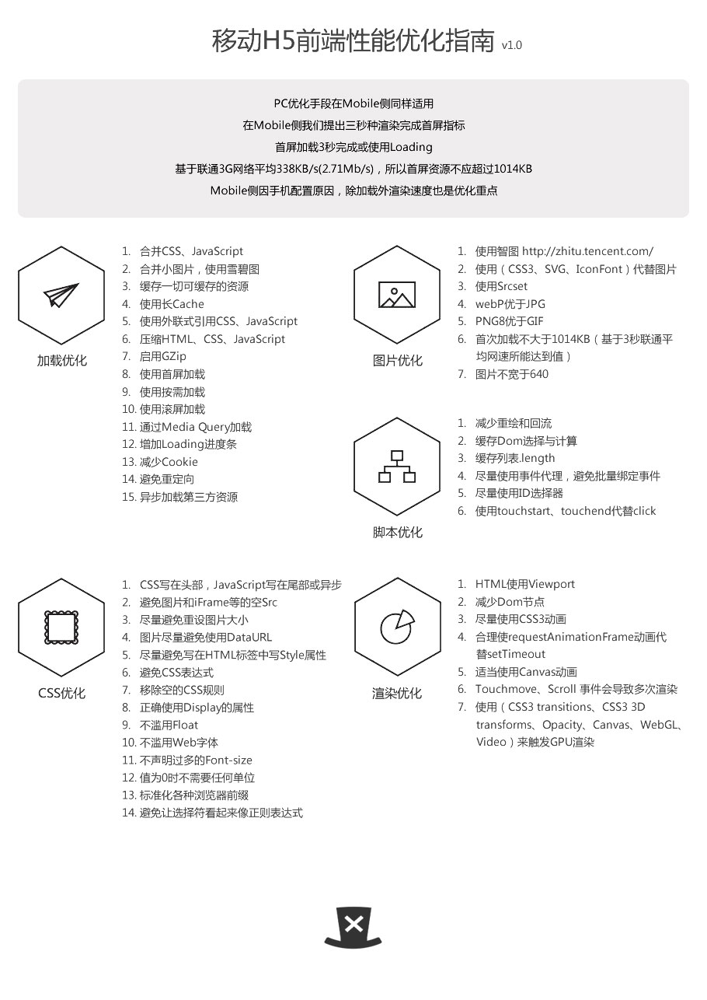

<h1>h5性能优化</h1>

来说了。

<h2>加载优化</h2>

1，合并css js这个应该是没说没说的。一般都是css写在上面，js写在下面。

2，css sprite

  使用雪碧图可以减少请求，但是对于移动端，我还不确定这种方式是否是最好的方式来处理小图标。

3，这句话我却不是那么认同。缓存一切可以缓存的东西，虽然可以减少请求，但是却还是有些弊端的。

  比如，我们处理的是H5外面套个IOS应用的壳子，这样可以轻松的实现不用重新发包里面的内容得以更改。
  但是，如果存在缓存，这个文字或者图标（尽管图标的名字重新起了新的名字）都会很难更新。

  为此，又不得不加了<meta http-equiv="pragram" content="no-cache"> 。用来清理缓存。

4，<a href="javascript:;">使用长Cache</a>

5,我觉得css写在html中就可以了，然后js外链。

6，gzip这个我没有使过，但是粗略的查了一下，代码压缩。我们现在是在使用require的来压缩css js

  文件。

7，

参考自 http://isux.tencent.com/h5-performance.html