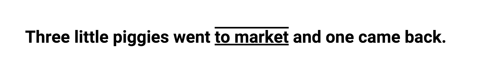
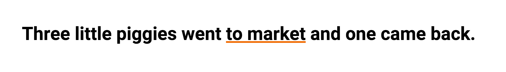
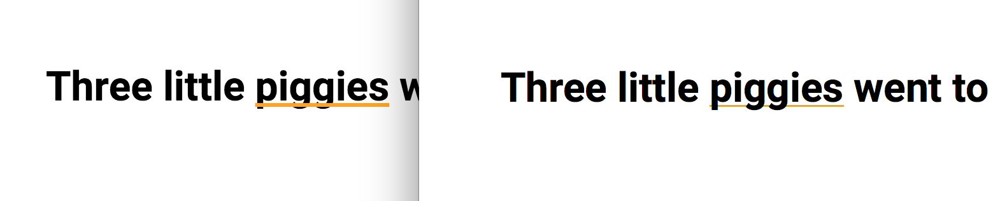
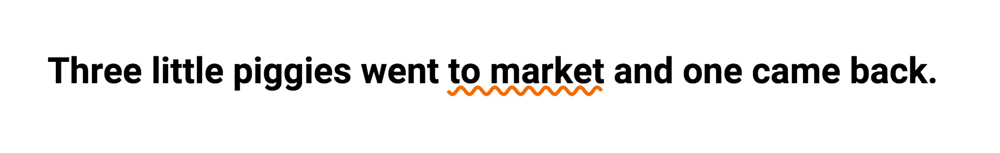

<h1>text-decoration的更多属性</h1>

许多默认的浏览器都是可以通过 text-decoration:underline; 来进行修饰文本。

同样，去掉是 text-decoration:none; 

但是你或许没有察觉到这个属性还有更多的玩法。

<h3>1,文本多个‘下’划线</h3>

	a{text-decoration:underline overline}

 

<h3>2,你可以改变下划线的颜色</h3>

下划线颜色的需求同调整文字颜色是一样的，但是你也可以这样调整:

	a{text-decoration:#f06d06;}

 

 注意：

 

 左侧的是 chrome 右侧的是firefox

 实际上在不同的浏览器中出现的underline略有不同，一种普通的方式来解决这种方法就是用border来替换text-decoration。边框可以控制颜色、宽窄以及位置，这点比text-decoration来说稍微好一些。
 但是，这还有一些东西边框并不能做，比如:

<h3>3,你可以改变边框的样式</h3>

你能让border也这样吗？

	a{text-decoration:wavy;}

 

